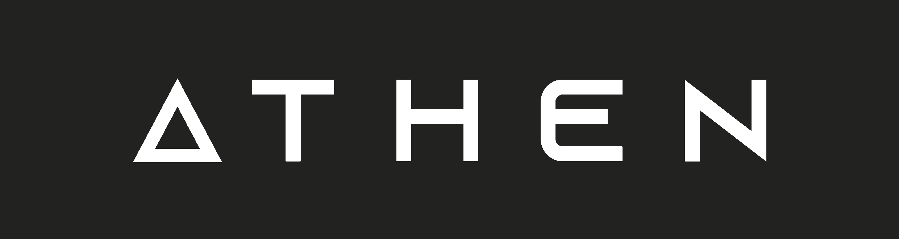

# Athen Labs

Welcome to the official repository of Athen Labs — a Brazilian software house specialising in the development of modern technological solutions. In this `README`, you will find essential information about who we are, what we do, and how you can collaborate with us.

## About

Athen Labs is an organisation dedicated to transforming innovative ideas into high-performance software products and bespoke technological solutions. We blend a passion for technology with the expertise of our talented team to deliver exceptional results. Our commitment lies in crafting tailored and efficient solutions for businesses across a wide range of sectors.

## Mission, Vision, and Values

### Mission

Our mission at Athen Labs is to empower organisations through cutting-edge technological solutions that foster growth, efficiency, and innovation. We are devoted to delivering premium software products and services that exceed our clients’ expectations, supporting them in achieving their goals. Through technical expertise, a passion for innovation, and an unwavering commitment to quality, we aspire to be a trusted partner in their digital transformation journey.

### Vision

We envision becoming a leading software house, renowned for creating transformative and impactful digital solutions. We see a future where businesses harness the full potential of technology to thrive in an ever-evolving digital landscape. By continually exploring new frontiers and embracing emerging technologies, we aim to shape the future of software development and contribute to the success of our clients and partners.

### Values

1. **Innovation**
   We embrace innovation by exploring new ideas, technologies, and methodologies. Our culture fosters creativity and encourages our team to think beyond conventions and drive continuous progress.

2. **Excellence**
   We pursue excellence in every aspect of our work. Through meticulous attention to quality and detail, we ensure our solutions meet the highest standards and consistently exceed expectations.

3. **Collaboration**
   We believe in the strength of collaboration. Our inclusive and supportive environment promotes teamwork, open communication, and shared success among clients, partners, and our team.

4. **Integrity**
   Integrity underpins our business. We operate with honesty, transparency, and professionalism, earning the trust of our clients and forming long-term, reliable partnerships.

5. **Customer Focus**
   Our customers are at the heart of everything we do. We listen, understand their unique challenges, and deliver tailored solutions that add real value to their business.

6. **Continuous Learning**
   We cultivate a culture of continuous learning. Our team is encouraged to grow their knowledge, adopt new skills, and stay abreast of industry advancements, ensuring we remain on the cutting edge.

Through our mission, vision, and values, we strive to positively impact businesses and society. We are committed to helping organisations unlock their full potential through the power of technology.

## Services

### Software Development

We specialise in building robust and scalable software solutions across various platforms. Our expertise includes web development, mobile applications, enterprise systems, APIs, and more — tailored to meet your specific business needs.

### Technology Consulting

Our consultancy services are designed to help organisations make informed technological decisions. Whether it's architecture planning, product strategy, or digital transformation, our experts are here to support you every step of the way.

### UX/UI Design

A seamless user experience and thoughtful design are crucial to product success. Our design team crafts intuitive and aesthetically pleasing interfaces that enhance user engagement and satisfaction.

### Maintenance and Support

Our relationship doesn’t end with delivery. We offer ongoing maintenance and technical support to ensure your systems remain up-to-date, secure, and optimised for performance.

## Technology

A brief overview of technologies our developers work with:

### Main stack

### Other tools

## Contact

We’d love to hear from you! Whether you have a question, suggestion, or would like to work with us:

- 🌐 Website: [athenlabs.io](https://athenlabs.io)
- 📧 Email: [eng.gabrielscardoso@gmail.com](mailto:eng.gabrielscardoso@gmail.com)
- 📞 Phone: [+55 91 98625-3389](tel:+5591986253389) (WhatsApp)

## Team

We are proud to work with a communicative, collaborative, and highly skilled team, united in delivering innovative and modern solutions.

Alphabetically:

- [Gabriel Santos Cardoso](https://github.com/eng-gabrielscardoso) – Founder & Developer
- [Luana Maria](https://github.com/Soonas) – Founder & Manager

---

_Thank you for visiting Athen Labs. We look forward to collaborating with you and helping to drive your projects forward through innovation and technology._

